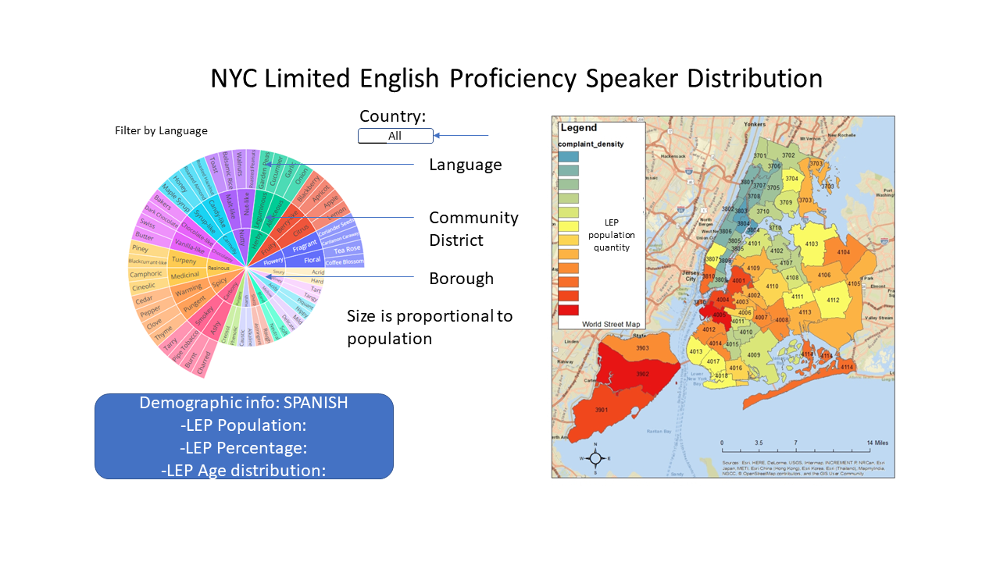

# Topic
Distribution of LEP speakers by community in New York City
# Dataset
Population and Languages of the Limited English Proficient (LEP) Speakers by Community District: [Link to dataset](https://data.cityofnewyork.us/City-Government/Population-and-Languages-of-the-Limited-English-Pr/ajin-gkbp)

# Inspiration
*WOW*
# Sketch
Our project includes 

You will need to create a one-page proposal that includes:
- A brief articulation of your chosen topic and rationale
- A link to your dataset(s) and a screenshot of the metadata, if it exists.	
- Three or four screenshots of relevant, “inspiring” visualizations that show your creative ideas	
- A sketch of the final design 	
- A link to the primary GitHub repository where you’ll be housing your work